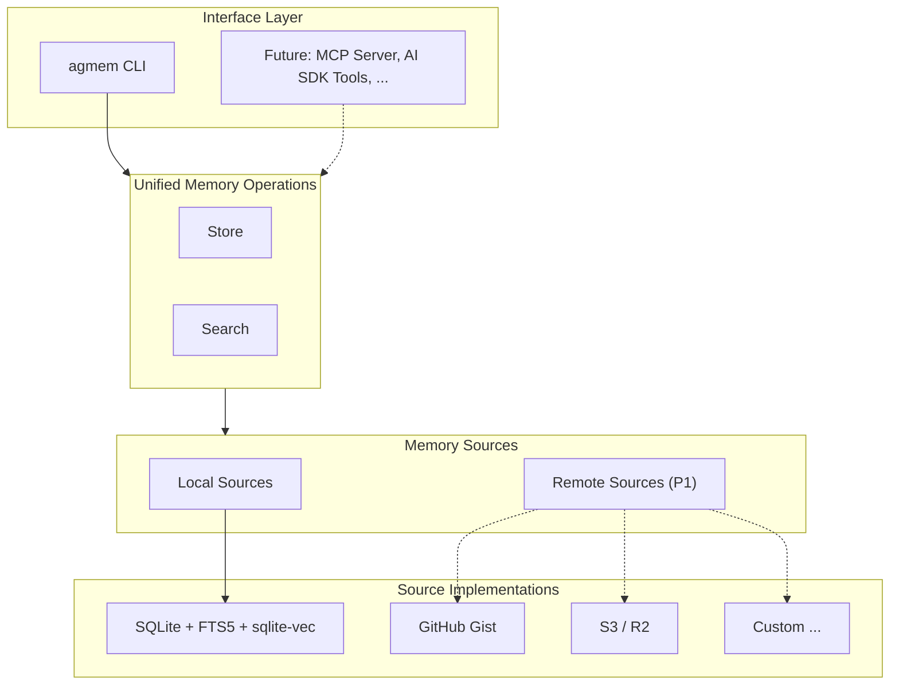

# agent-memory

Long-term, cross-project memory for AI agents.

Modern AI agents (Claude Code, Codex, Cursor, etc.) come with their own short-term memory — `CLAUDE.md`, `AGENTS.md`, `.cursorrules`. These are curated by humans, loaded every session, and focused on **what matters right now**.

But agents forget everything else. The workaround you discovered last month, the architecture decision from a different project, the lesson learned from a failed deployment — gone.

**agent-memory** is the long-term memory layer. It stores what doesn't belong in your instruction files but might be useful someday. Agents write to it, search it, and recall from it. `agmem` is the CLI interface — one of potentially many ways to interact with agent-memory.

## Quick Start

```bash
# Install globally
npm install -g @agent-memory/cli

# Initialize (downloads local embedding model, ~65MB)
agmem run init

# Store a memory
agmem add "Node 22 ESM has path resolution bug in monorepo" --tags node,esm

# Search (hybrid: keyword + semantic)
agmem search "ESM compatibility"

# Get full content by ID
agmem get <id>
```

## Commands

```
Core:       add / get / update / delete / search / list / tags / stats
Config:     config set / get / list / delete
Source:     source list / run <cmd>
```

### Memory CRUD

```bash
agmem add <content> [--tags t1,t2] [--digest "summary"]
agmem get <id> [--full]
agmem update <id> [--content text] [--tags t1,t2] [--digest text]
agmem delete <id> [<id>...]

# Pipe from stdin
echo "long content" | agmem add --tags lesson
```

### Search & Browse

```bash
agmem search <query> [--tags t1,t2] [--limit n] [--after date] [--before date]
agmem list [--tags t1,t2] [--sort time|access] [--limit n] [--offset n]
agmem tags
agmem stats
```

Search returns `digest` (not full content) — use `agmem get <id>` for full detail. This progressive disclosure pattern saves tokens for agents.

### Source Commands

```bash
agmem run                  # List available commands for current source
agmem run init             # Initialize source (download embedding model)
agmem run status           # Show source status
agmem run embed            # Batch embed un-indexed memories
agmem run embed-rebuild    # Full rebuild of all embeddings
agmem run embed-status     # Show embedding index status
```

### Config

```bash
agmem config set <key> <value> [--source name]
agmem config get <key> [--source name]
agmem config list [--source name]
agmem config delete <key> [--source name]
```

### Output Formats

| Flag | Format | Use case |
|------|--------|----------|
| _(default)_ | TOON | LLM-optimized, ~40% fewer tokens than JSON |
| `--json` | JSON | Machine parsing |
| `--human` | Human | Terminal display |

## Design Philosophy

### Tools, not opinions

agent-memory provides storage and retrieval primitives. It doesn't decide when to remember, what to recall, or how to organize your knowledge. That's up to you and your agents. A good tool is one that gets out of the way.

### Supplement, not replace

Every serious agent has its own memory system. agent-memory doesn't compete with `CLAUDE.md` or `.cursorrules` — those are your working memory, actively maintained and always loaded. agent-memory is the archive: large, searchable, and pulled in only when relevant.

### Agent-first, human-friendly

The primary user is an AI agent calling `agmem` via shell. The interface is designed for programmatic use — structured output, composable commands, and predictable behavior. But humans can read and manage it too.

### Any agent, one memory

A memory stored by Claude Code can be recalled by Codex. A lesson learned in Cursor is available in your terminal agent. agent-memory is the shared long-term memory across all your tools — the one place that doesn't fragment by vendor.

### Multiple sources, unified interface

Memories can live anywhere — a local SQLite database, a GitHub Gist, an S3 bucket, or a custom backend. agent-memory abstracts over these as **memory sources**. You choose where your memories are stored based on your needs: local for speed and privacy, remote for sharing and sync. Each source defines its own capabilities via `agmem run`.

## Architecture



## Local Source

The default `local` source uses SQLite with:

- **FTS5** for keyword search (always on)
- **sqlite-vec** for vector similarity search
- **RRF (Reciprocal Rank Fusion)** to merge both result sets
- **nomic-embed-text-v1.5** (768 dims, local, no API key needed)

Embeddings are generated automatically on `add` and `update`. No manual indexing step required.

```
agmem search <query>
  ├── FTS5 keyword search (always on)
  ├── Vector similarity search (when embeddings available)
  └── RRF Fusion: score = Σ 1/(k + rank_i), k=60
      → merged, deduplicated, sorted
      → post-filter by tags/date
```

## Development

```bash
bun install          # Install dependencies
bun run build        # Compile TypeScript
bun run test         # Run tests
bun run dev          # Watch mode
```
